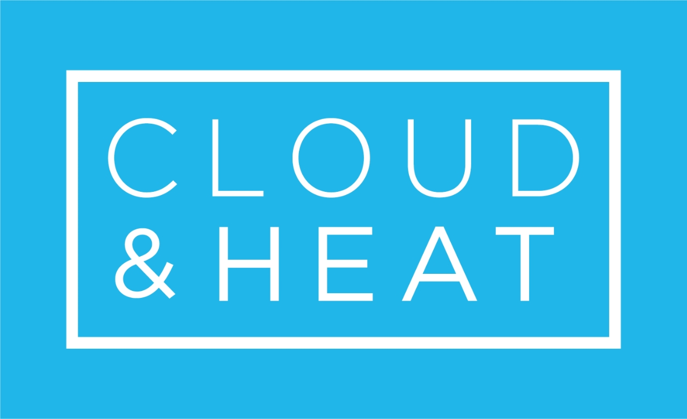
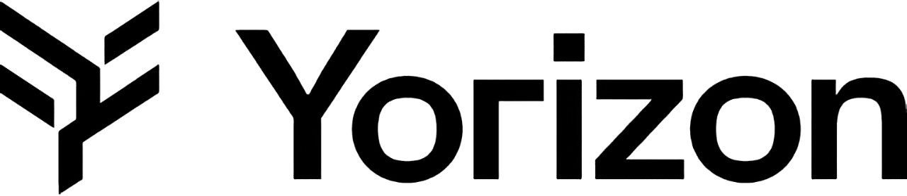

## Standardization. Collaboration. Continuity.

Der SCS Summit ist die jährliche Hauptveranstaltung der Community rund um den Sovereign Cloud Stack (SCS).

Hier treffen sich Akteur:innen aus der Praxis, Entwicklung, Verwaltung, Forschung und der Community, um Erfahrungen zu Cloud Computing und digitaler Souveränität auszutauschen. Der Summit fördert praxisnahen Wissenstransfer, Vernetzung und die gemeinsame Weiterentwicklung souveräner Cloud-Infrastrukturen.

## Sichern Sie sich jetzt Ihr [kostenfreies Ticket](https://events.sovereigncloudstack.org/scs-summit-2025/)!

### Wann

Der SCS Summit 2025 findet am 24. September im Palisa in Berlin statt.
Die Veranstaltung startet um 10:00 Uhr und geht bis in den Abend.

### Wo

[Palisa](https://www.palisa.de)  
Palisadenstraße 48  
10243 Berlin  

## Programm

|   |   |   |
|---|---|---|
| Einlass | 09:00-10:00 | **Registrierung** |
| Teil I | 10:00-10:15 | **Eröffnung**   Lisa Seifert (Projektleiterin Forum SCS Standards) & Anja Voß (Moderatorin) |
| | 10:15-10:25 | **Grußwort**   Peter Ganten (Vorstandsvorsitzender OSBA) |
| | 10:25-10:50 | **Keynote "..."**   Christopher Maier, Thomas Krenn |
| | 10:50-11:15 | **Keynote "..."**   Dr. Daniel Gerber (Geschäftsführender Vorstand OSBA, Entwickler ALASCA) |
| | 11:15-11:45 | **Keynote "Souverän auf allen Ebenen: Ein Tech-Stack für die Öffentliche Verwaltung"**   Leonhard Kugler (Leiter Open Source-Plattform bei ZenDiS) |
| | 11:45-12:00 | **Pause** |
| Teil II | 12:00-12:20 | **Talk "..."** |

## Unsere Sponsoren

### Gold

### Silber

## Hier sichern Sie sich Ihr kostenfreies Ticket!

Eine Anmeldung für den Summit ist [hier](https://events.sovereigncloudstack.org/scs-summit-2025/) kostenfrei möglich.

### Warum sollten Sie dabei sein?

- Teilen Sie Ihr Wissen mit einer engagierten Fach-Community
- Vernetzen Sie sich mit Expert:innen und Entscheider:innen
- Gestalten Sie die digitale Zukunft in Europa aktiv mit

## Kontakt

Bei Fragen oder Ideen zum Summit melden Sie sich gerne unter scs-summit@osb-alliance.com.
