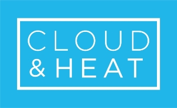
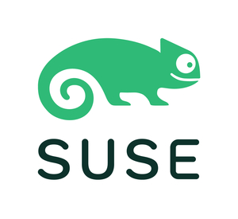
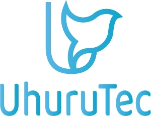
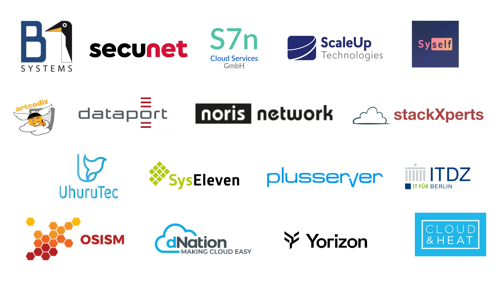

## Standardization. Collaboration. Continuity.

Der SCS Summit ist die jährliche Hauptveranstaltung der Community rund um den Sovereign Cloud Stack (SCS).

Hier treffen sich Akteur:innen aus der Praxis, Entwicklung, Verwaltung, Forschung und der Community, um Erfahrungen zu Cloud Computing und digitaler Souveränität auszutauschen. Der Summit fördert praxisnahen Wissenstransfer, Vernetzung und die gemeinsame Weiterentwicklung souveräner Cloud-Infrastrukturen.

## Sichern Sie sich jetzt Ihr [kostenfreies Ticket](https://events.sovereigncloudstack.org/scs-summit-2025/)!

### Wann

Der SCS Summit 2025 findet am **24. September im Palisa in Berlin** statt.
Die Veranstaltung startet um 10:00 Uhr und geht bis in den Abend.

### Wo

[Palisa](https://www.palisa.de)  
Palisadenstraße 48  
10243 Berlin  

## Programm

|   |   |
|---|---|
| 09:00-10:00 | **Registrierung & Empfang**   Ankommen. Einchecken. Vernetzen. |
| 10:00-10:10 | **Begrüßung & Programmvorstellung**   Lisa Seifert (Projektleiterin Forum SCS-Standards), Anja Voß (Projektmanagerin DigitalHub.SH) |
| 10:10-10:20 | **Grußwort**   Diego Calvo de Nó (Finanzvorstand OSBA, CEO Proventa AG), Janis Kemper (Sprecher Forum SCS-Standards, Co-Founder Syself GmbH) ([Aufzeichnung bei YouTube](https://www.youtube.com/watch?v=iIudEaQLEi0)) |
| 10:25-10:55 | **Vom Risiko zur Chance: Wie geopolitische Entwicklungen Europas IT beeinflussen**   Christoph Maier (CEO Thomas-Krenn.AG) ([Aufzeichnung bei YouTube](https://www.youtube.com/watch?v=jaLcuASkbl4)) |
| 11:00-11:20 | **„Frei wie in Freiheit“ für Europa – Offener Code gegen Digitale Abhängigkeit**   Dr. Daniel Gerber (Stellvertretender Vorstandsvorsitzender OSBA, Entwickler ALASCA e.V.) ([Aufzeichnung bei YouTube](https://www.youtube.com/watch?v=jI8goneZHf8)) |
| 11:20-11:40 | **Kurze Pause**   Erfrischen. Aktivieren. Ins Gespräch kommen. |
| 11:45-13:00 | **Deutschlandstack – Mehr Chance als Risiko** – eGovernment Podcast @ SCS Summit 2025   Torsten Frenzel (Host & Moderator eGovernment Podcast), Julian Schauder (Technischer Produktmanager ZenDiS), Jutta Horstmann (Co-CEO Heinlein Gruppe), Luise Kranich (Abteilungsleiterin Technologiestrategie & Informationstechnik BSI), Ralph Dehner (Sprecher Forum SCS-Standards, Gründer/CEO B1 Systems GmbH), Thilak Mahendran (Innovation Lead Agora Digitale Transformation gGmbH) ([Aufzeichnung bei YouTube](https://www.youtube.com/watch?v=qXAk5NhrRok)) |
| 13:00-14:00 | **Mittagspause**   Gemeinsam essen. Energie aufladen. Kontakte knüpfen. |
| 14:05-14:30 | **„Goodbye VMware“ – Migration unserer VMware Plattform auf OpenStack (SCS/OSISM) als Serviceprovider**   Jan Mußmann (Geschäftsführer/CTO UPONU GmbH) ([Aufzeichnung bei YouTube](https://www.youtube.com/watch?v=lBxbaQoqYio)) |
| 14:30-14:55 | **Multi-Provider-Cloud-Architektur bei der BTC AG: Strategie, Implementierung und gewonnene Erkenntnisse**   Christian Berendt (Geschäftsführer OSISM GmbH), Timon Schnell (General Service Owner BTC IT Services GmbH) ([Aufzeichnung bei YouTube](https://www.youtube.com/watch?v=abkl9ZaKeF0)) |
| 14:55-15:20 | **Completing the Sovereign Stack**   Kurt Garloff (CEO S7n Cloud Services GmbH), Assaf Sauer (Gründer/CTO Stacktic) ([Aufzeichnung bei YouTube](https://www.youtube.com/watch?v=1lNkM3xwVnA)) |
| 15:20-15:45 | **Eine Reise mit Höhen und Tiefen hin zur Souveränität in großem Maßstab**   Lisa Meindl (Products & Services Yorizon GmbH & Co. KG), Michael Bayr (Gründer/CEO artcodix GmbH) ([Aufzeichnung bei YouTube](https://www.youtube.com/watch?v=sen5ydGhGA0)) |
| 15:50-16:10 | **Kaffeepause**   Aufrappeln. Kräfte sammeln. Ideen austauschen. |
| 16:15-16:45 | **Progress on the SCS reference implementation**   Kurt Garloff & Christian Berendt (SCS Project Board) ([Aufzeichnung bei YouTube](https://www.youtube.com/watch?v=KR7hB8TxLBA)) |
| 16:45-17:30 | **With Standardization through Collaboration and Continuity to Certification: Von der Arbeit des Forum SCS-Standards** – mit Verleihung der ersten SCS-Zertifikate!   Felix Kronlage-Dammers (Leiter Forum SCS-Standards) ([Aufzeichnung bei YouTube](https://www.youtube.com/watch?v=L3aTcKYxZKU)) |
| ab 17:30 | **Get Together**   Genießen. Gespräche vertiefen. Den Tag ausklingen lassen. |

Die Vorträge werden auf Deutsch gehalten. Wir bieten eine Live-Transkription ins Englische an.

Damit Sie sich voll und ganz auf das Programm konzentrieren können, sorgen wir durchgehend für Essen und Getränke.

## Unsere Sponsoren

### Goldsponsoren

### Silbersponsoren

### Mediasponsoren

### SCS-Mitglieder

Der SCS Summit 2025 wird unterstützt von den Mitgliedern des Forum SCS-Standards:

## Hier sichern Sie sich Ihr kostenfreies Ticket!

Eine Anmeldung für den Summit ist [hier](https://events.sovereigncloudstack.org/scs-summit-2025/) kostenfrei möglich.

### Warum sollten Sie dabei sein?

- Teilen Sie Ihr Wissen mit einer engagierten Fach-Community
- Vernetzen Sie sich mit Expert:innen und Entscheider:innen
- Gestalten Sie die digitale Zukunft in Europa aktiv mit

## Kontakt

Bei Fragen oder Ideen zum Summit melden Sie sich gerne unter scs-summit@osb-alliance.com.
