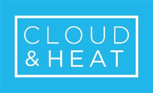
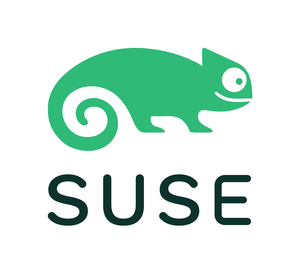
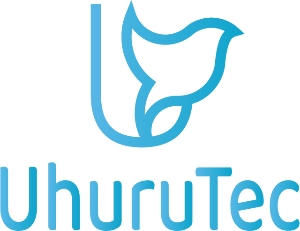
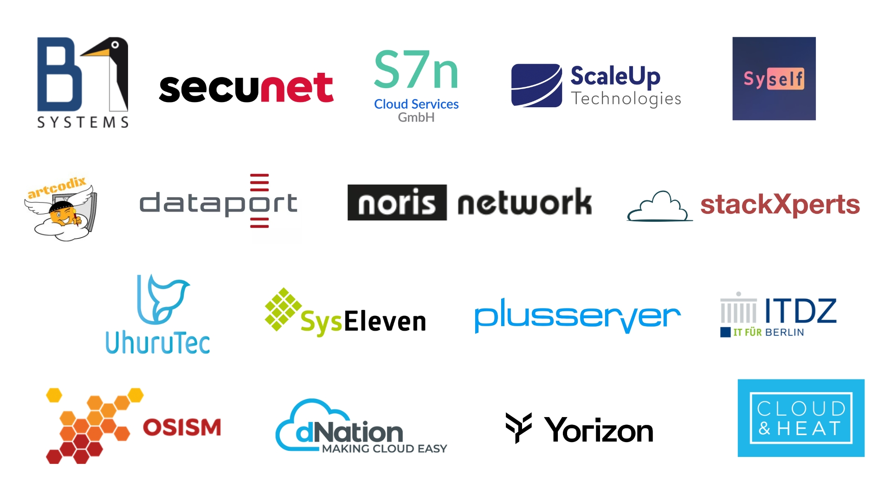

## Standardization. Collaboration. Continuity.

The SCS Summit is the main annual event for the Sovereign Cloud Stack (SCS) community.

This is where players from practice, development, administration, research and the community meet to exchange experiences on cloud computing and digital sovereignty. The summit promotes practical knowledge transfer, networking and the joint further development of sovereign cloud infrastructures.

## Register now for your [free ticket](https://events.sovereigncloudstack.org/scs-summit-2025/)!

### When

The SCS Summit 2025 will take place on **24th of September at the Palisa in Berlin**.
The event will start at 10:00 AM and will go until the evening.

### Where

[Palisa](https://www.palisa.de/welcome)  
Palisadenstraße 48  
10243 Berlin  

## Program

|   |   |
|---|---|
| 09:00-10:00 | **Registration & Reception**   Arrive. Check in. Connect. |
| 10:00-10:10 | **Welcome & Introduction**   Lisa Seifert (Project management Forum SCS-Standards), Anja Voß (Project management DigitalHub.SH) |
| 10:10-10:20 | **Greeting**   Diego Calvo de Nó (CFO OSBA, CEO Proventa AG), Janis Kemper (Spokesperson Forum SCS-Standards, Co-Founder Syself GmbH) ([Recording on YouTube](https://www.youtube.com/watch?v=iIudEaQLEi0)) |
| 10:25-10:55 | **From risk to opportunity: How geopolitical developments are influencing Europe's IT**   Christoph Maier (CEO Thomas-Krenn.AG) ([Recording on YouTube](https://www.youtube.com/watch?v=jaLcuASkbl4)) |
| 11:00-11:20 | **“Free as in freedom” for Europe – open source against digital dependency**   Dr. Daniel Gerber (Deputy Chairman of the Board of Directors OSBA, Developer ALASCA e.V.) ([Recording on YouTube](https://www.youtube.com/watch?v=jI8goneZHf8)) |
| 11:20-11:40 | **Short break**   Refresh. Energize. Engage in conversations. |
| 11:45-13:00 | **Deutschlandstack – More opportunity than risk** – eGovernment Podcast @ SCS Summit 2025   Torsten Frenzel (Host & Moderator eGovernment Podcast), Julian Schauder (Technical Product Manager ZenDiS), Jutta Horstmann (Co-CEO Heinlein Gruppe), Luise Kranich (Head of Technology Strategy & Information Technology BSI), Ralph Dehner (Spokesperson Forum SCS Standards, Founder/CEO B1 Systems GmbH), Thilak Mahendran (Innovation Lead Agora Digitale Transformation gGmbH) ([Recording on YouTube](https://www.youtube.com/watch?v=qXAk5NhrRok)) |
| 13:00-14:00 | **Lunch break**   Eat together. Recharge batteries. Make contacts. |
| 14:05-14:30 | **“Goodbye VMware” – Migration of our VMware platform to OpenStack (SCS/OSISM) as a service provider**   Jan Mußmann (CEO/CTO UPONU GmbH) ([Recording on YouTube](https://www.youtube.com/watch?v=lBxbaQoqYio)) |
| 14:30-14:55 | **Multi-provider cloud architecture at BTC AG: strategy, implementation, and lessons learned**   Christian Berendt (CEO OSISM GmbH), Timon Schnell (General Service Owner BTC IT Services GmbH) ([Recording on YouTube](https://www.youtube.com/watch?v=abkl9ZaKeF0)) |
| 14:55-15:20 | **Completing the Sovereign Stack**   Kurt Garloff (CEO S7n Cloud Services GmbH), Assaf Sauer (Founder/CTO Stacktic) ([Recording on YouTube](https://www.youtube.com/watch?v=1lNkM3xwVnA)) |
| 15:20-15:45 | **A journey with ups and downs toward sovereignty on a large scale**   Lisa Meindl (Products & Services Yorizon GmbH & Co. KG), Michael Bayr (Founder/CEO artcodix GmbH) ([Recording on YouTube](https://www.youtube.com/watch?v=sen5ydGhGA0)) |
| 15:50-16:10 | **Coffee break**   Get up. Gather strength. Exchange ideas. |
| 16:15-16:45 | **Progress on the SCS reference implementation**   Kurt Garloff & Christian Berendt (SCS Project Board) ([Recording on YouTube](https://www.youtube.com/watch?v=KR7hB8TxLBA)) |
| 16:45-17:30 | **With Standardization through Collaboration and Continuity to Certification: From the work of the Forum SCS-Standards** – with awarding of the first SCS certificates!   Felix Kronlage-Dammers (Head of Forum SCS-Standards) ([Recording on YouTube](https://www.youtube.com/watch?v=L3aTcKYxZKU)) |
| from 17:30 | **Get Together**   Feast. Deepen conversations. Close out the day. |

The talks will be held in German. We offer live transcription in English.

We will provide food and drinks throughout the event so that you can concentrate fully on the program.

## Our sponsors

### Gold sponsors

### Silver sponsors

### Media sponsors

### SCS members

The SCS Summit 2025 is supported by the members of the Forum SCS-Standards:

## Secure your free Ticket!

You can register for the summit for free [here](https://events.sovereigncloudstack.org/scs-summit-2025/).

### Why participate?

- Share your knowledge with a dedicated professional community
- Network with experts and decision-makers
- Actively shape the digital future in Europe

## Contact

If you have any questions or ideas about the summit, please contact us at scs-summit@osb-alliance.com.
